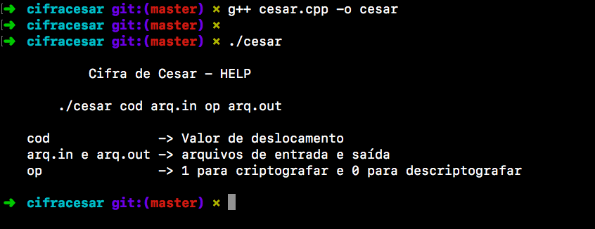
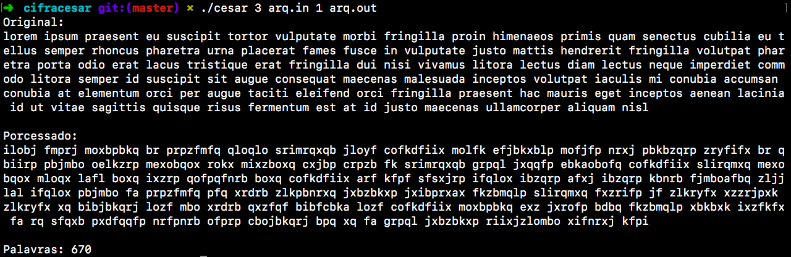
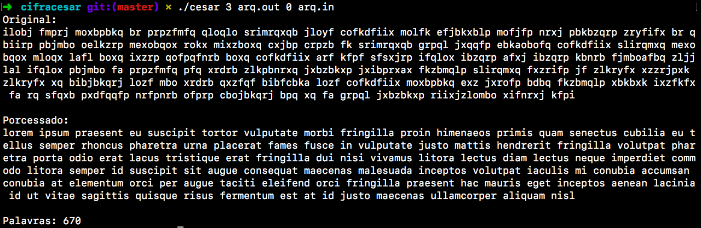

# Cifra de César
Algoritmo para cifragem e decifragem da Cifra de César 

Em criptografia, a Cifra de César, é uma das mais simples e conhecidas técnicas de criptografia. É um tipo de cifra de substituição na qual cada letra do texto é substituída por outra, que se apresenta no alfabeto abaixo dela um número fixo de vezes. O nome do método é em homenagem a Júlio César, que o usou para se comunicar com os seus generais.

## Exemplos
### Instruções - Compilação

### Criptografia

### Descriptografia
